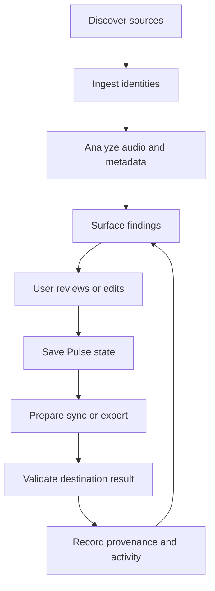

# Pulse Loop Map

## Canonical operational loop

## Loop stages

### 1. Discover

The desktop companion observes user-approved local folders, external drives, DJ databases, and reachable NAS locations. Backend-only deployments must not pretend to see Mac-local paths.

### 2. Ingest

Pulse creates stable track and audio-asset identities. A musical track and a physical audio location are separate concepts. One track may have multiple locations or versions.

### 3. Analyze

Jobs calculate deterministic features and suggested values. Analysis results include algorithm/version, timestamp, confidence where applicable, and source asset.

### 4. Surface

Dashboard modules, collections, table indicators, and Review Center queues convert system findings into prioritized, understandable work.

### 5. Review

The user auditions, compares, accepts, rejects, edits, or defers. Review must preserve context and allow rapid keyboard-driven work.

### 6. Save

Saving commits the Pulse workspace state. It does not imply that Rekordbox, Traktor, a file tag, or another destination has changed.

### 7. Sync/export

An adapter builds a proposed destination delta, checks capability and conflicts, and applies only the confirmed plan.

### 8. Validate

Pulse verifies what the adapter can verify, reports partial outcomes honestly, and avoids a generic success message when some items failed.

### 9. Learn

Pulse remembers user decisions, rule preferences, view state, and accepted defaults. Learning must remain inspectable and reversible.

## Feedback loops

- Rejected suggestions improve future ranking but do not silently become universal rules.
- Adapter failures create actionable review items, not generic notifications.
- Missing assets update availability while preserving track metadata.
- User corrections preserve both the corrected value and its previous provenance.
- Every recurrent automation ends in either no action, an explainable suggestion, or a logged result.

## Loop health metrics

- Time from ingest to prepared track.
- Percentage of suggestions accepted without edits.
- Review backlog by category and confidence.
- Failed/partial sync rate.
- Missing-asset rate.
- Duplicate-resolution accuracy.
- Time to locate a track.
- Percentage of operations with complete provenance.

