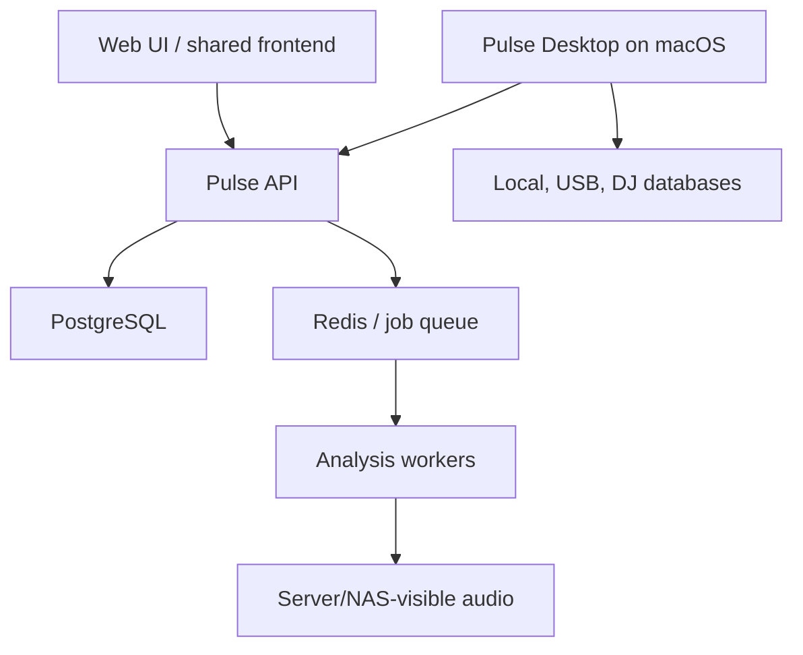

# System Architecture

## Target topology

## Deployment model

- Backend runs on Proxmox as Docker services.
- Frontend and backend are fully separated.
- PostgreSQL is canonical structured state.
- Redis supports queues/ephemeral coordination, not durable truth.
- Workers perform server-visible analysis and long-running jobs.
- Pulse Desktop is a native macOS companion, not a thin decorative wrapper.

## Desktop responsibilities

- User-approved local filesystem access.
- Security-scoped/persisted access appropriate to macOS.
- Local/external-drive availability.
- Local audio playback.
- DJ database integration.
- USB/export workflows.
- Device-local analysis when source files are not server-visible.
- Progressive offline behavior and eventual reconciliation.

Persisted local-file bookmarks and playback telemetry were previously deferred; in the reboot they remain deferred until their contracts and privacy behavior are deliberately designed.

## Backend responsibilities

- Authentication/device identity.
- Library isolation and authorization.
- Track, asset, metadata, crates, review, activity, job, and adapter state.
- Server-visible storage and analysis.
- Contracted search.
- Change plans, audit, and integration orchestration.

## Contract principles

- API-first and versioned.
- OpenAPI generated and validated.
- RFC 9457-style problem details.
- Idempotency for retryable mutations/jobs.
- Cursor pagination for large collections.
- Explicit concurrency/version fields for editable entities.
- Server-sent events or another defined transport for job updates.
- No UI field wired to invented placeholder data.

## Domain boundaries

- Identity: users, devices, Libraries.
- Catalog: tracks, assets, locations, metadata.
- Organization: crates, smart rules, tags, saved views.
- Analysis: jobs, results, confidence, algorithm versions.
- Review: issues, decisions, resolution history.
- Playback/preparation: current context, cues, structure.
- Integration: adapters, capability, import/export plans, conflicts.
- Operations: jobs, activity, notifications, health.

## Security

- Library-scoped authorization on every resource.
- Device credentials revocable and never committed.
- Least-privilege filesystem access.
- No arbitrary server path ingestion from untrusted clients.
- Validate archives, media probes, and external metadata.
- Sensitive paths and tokens excluded from telemetry/reports.

## Reliability

- Database migrations are forward-safe and tested.
- Jobs are resumable or safely retryable.
- Partial adapter outcomes are first-class.
- Backups cover database and user-generated configuration.
- Audio files are referenced and protected; Pulse does not become an accidental destructive file manager.

## Proposed technical choices

The prior implementation used FastAPI, PostgreSQL, Redis, ARQ, and Alembic successfully. These are sensible candidates, not automatically binding. The new foundation milestone must write a short ADR based on current requirements before adopting them.

